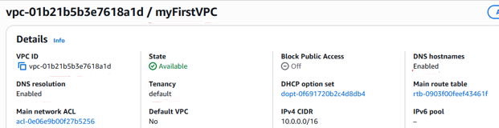
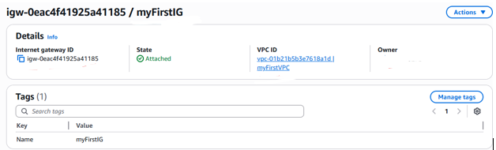
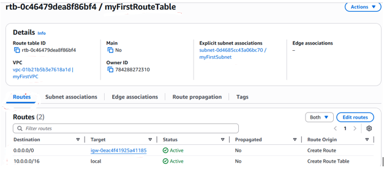
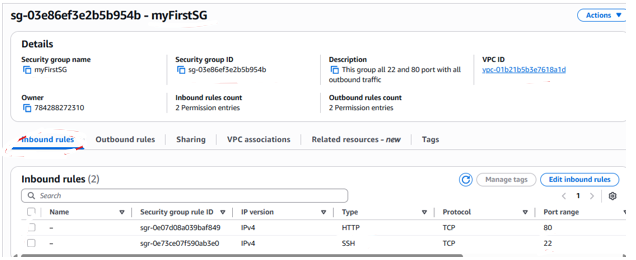
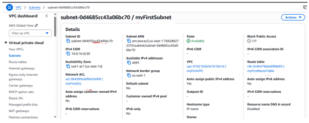
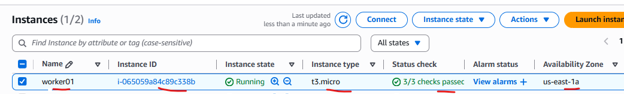

# terraform-aws-infra
## This codes will create AWS infrastructure that will be:

- VPC group
- Internet Gateway
- Route table
- Security Group
- Subnet
- EC2 instance using above network configuration

## The screenshot of created infrastructure

VPC group

Internet Gateway

Route table

Security Group

Subnet

EC2 instance using above network configuration
